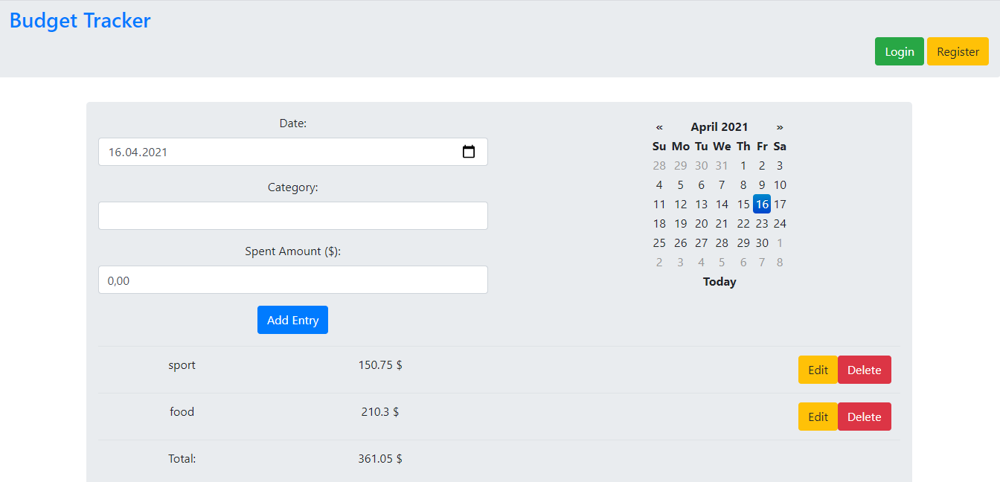

BudgetTrackerApp
==================
Budget tracker app using python, flask, bootstrap and jquery

Live Demo
----------
[Budget Tracker App demo](https://budget-demo-tracker.herokuapp.com)

Requires
-------------
 * Python 3

Python Modules
--------------
 * pip install -r requirements.txt

Initializing the Flask
----------------------
 * set FLASK_APP=budget_tracker.py

Initializing the Database
-------------------------
 * flask db init
 * flask db migrate
 * flask db upgrade

Run App
-------
* flask run

 open http://127.0.0.1:5000/
